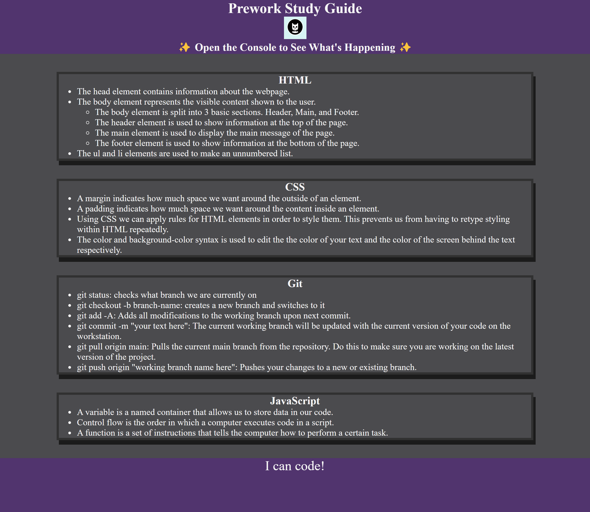

# Prework Study Guide Webpage

## Description

This Prework Study Guide was meant to compile the information learned throughout the first 3 modules of the prework. It consists of notes on HTML, CSS, Git, and JavaScript.

## Link

[Deployed Site](https://mateo-wallace.github.io/Prework-Study-Guide/)

## Screenshot

## Usage

Use the Study Guide to review the basic concepts of coding. For suggestions on what to study first, open the Chrome DevTools by pressing Command+Option+I (macOS) or Control+Shift+I (Windows). A console panel should open either below or to the side of the webpage in the browser. There you will see a list of topics we learned from the prework along with a suggestion on which topic to study first.

## License

Please refer to the LICENSE in the repo.
